# pyscratch

`pyscratch` - это маленькая библиотека для Python, похожая на Scratch.

Идея такая: ты знаешь блоки Scratch, а здесь пишешь почти то же самое, только текстом на Python.

## Карта блоков

В таблицах ниже собраны SVG-блоки из `images/motion` и `images/looks`. Если блок уже есть в `pyscratch`, ссылка ведет к описанию ниже. Если API для блока еще нет, указано `В разработке`.

### Motion / Движение

<table>
<thead>
<tr>
<th>Scratch-блок</th>
<th>pyscratch</th>
</tr>
</thead>
<tbody>
<tr>
<td><a href="#spritemove_stepssteps">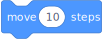</a></td>
<td><a href="#spritemove_stepssteps"><code>sprite.move_steps(10)</code></a></td>
</tr>
<tr>
<td><a href="#spriteturn_rightdegrees"></a></td>
<td><a href="#spriteturn_rightdegrees"><code>sprite.turn_right(15)</code></a></td>
</tr>
<tr>
<td><a href="#spriteturn_leftdegrees"></a></td>
<td><a href="#spriteturn_leftdegrees"><code>sprite.turn_left(15)</code></a></td>
</tr>
<tr>
<td></td>
<td>В разработке</td>
</tr>
<tr>
<td></td>
<td>В разработке</td>
</tr>
<tr>
<td></td>
<td>В разработке</td>
</tr>
<tr>
<td><a href="#spritego_tox-y"></a></td>
<td><a href="#spritego_tox-y"><code>sprite.go_to(0, 0)</code></a></td>
</tr>
<tr>
<td>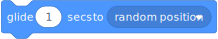</td>
<td>В разработке</td>
</tr>
<tr>
<td></td>
<td>В разработке</td>
</tr>
<tr>
<td></td>
<td>В разработке</td>
</tr>
<tr>
<td></td>
<td>В разработке</td>
</tr>
<tr>
<td><a href="#spritepoint_in_directiondegrees">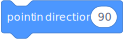</a></td>
<td><a href="#spritepoint_in_directiondegrees"><code>sprite.point_in_direction(90)</code></a></td>
</tr>
<tr>
<td></td>
<td>В разработке</td>
</tr>
<tr>
<td></td>
<td>В разработке</td>
</tr>
<tr>
<td><a href="#spritechange_x_byvalue"></a></td>
<td><a href="#spritechange_x_byvalue"><code>sprite.change_x_by(10)</code></a></td>
</tr>
<tr>
<td><a href="#spriteset_xvalue">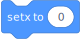</a></td>
<td><a href="#spriteset_xvalue"><code>sprite.set_x(0)</code></a></td>
</tr>
<tr>
<td><a href="#spritechange_y_byvalue">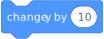</a></td>
<td><a href="#spritechange_y_byvalue"><code>sprite.change_y_by(10)</code></a></td>
</tr>
<tr>
<td><a href="#spriteset_yvalue"></a></td>
<td><a href="#spriteset_yvalue"><code>sprite.set_y(0)</code></a></td>
</tr>
<tr>
<td><a href="#spriteif_on_edge_bounce">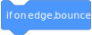</a></td>
<td><a href="#spriteif_on_edge_bounce"><code>sprite.if_on_edge_bounce()</code></a></td>
</tr>
<tr>
<td>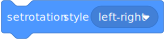</td>
<td>В разработке</td>
</tr>
<tr>
<td>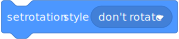</td>
<td>В разработке</td>
</tr>
<tr>
<td>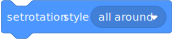</td>
<td>В разработке</td>
</tr>
<tr>
<td><a href="#spritename"></a></td>
<td><a href="#spritename"><code>sprite.x</code></a></td>
</tr>
<tr>
<td><a href="#spritename"></a></td>
<td><a href="#spritename"><code>sprite.y</code></a></td>
</tr>
<tr>
<td><a href="#spritepoint_in_directiondegrees"></a></td>
<td><a href="#spritepoint_in_directiondegrees"><code>sprite.direction</code></a></td>
</tr>
</tbody>
</table>

### Looks / Внешний вид

<table>
<thead>
<tr>
<th>Scratch-блок</th>
<th>pyscratch</th>
</tr>
</thead>
<tbody>
<tr>
<td></td>
<td>В разработке</td>
</tr>
<tr>
<td>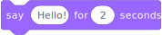</td>
<td>В разработке</td>
</tr>
<tr>
<td></td>
<td>В разработке</td>
</tr>
<tr>
<td></td>
<td>В разработке</td>
</tr>
<tr>
<td><a href="#spriteshow"></a></td>
<td><a href="#spriteshow"><code>sprite.show()</code></a></td>
</tr>
<tr>
<td><a href="#spritehide">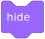</a></td>
<td><a href="#spritehide"><code>sprite.hide()</code></a></td>
</tr>
<tr>
<td><a href="#spriteswitch_costume_tocostume">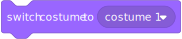</a></td>
<td><a href="#spriteswitch_costume_tocostume"><code>sprite.switch_costume_to("costume1")</code></a></td>
</tr>
<tr>
<td><a href="#spritenext_costume">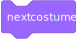</a></td>
<td><a href="#spritenext_costume"><code>sprite.next_costume()</code></a></td>
</tr>
<tr>
<td>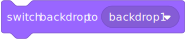</td>
<td>В разработке</td>
</tr>
<tr>
<td>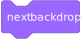</td>
<td>В разработке</td>
</tr>
<tr>
<td><a href="#spritechange_size_byvalue">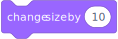</a></td>
<td><a href="#spritechange_size_byvalue"><code>sprite.change_size_by(10)</code></a></td>
</tr>
<tr>
<td><a href="#spriteset_size_tovalue">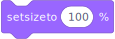</a></td>
<td><a href="#spriteset_size_tovalue"><code>sprite.set_size_to(100)</code></a></td>
</tr>
<tr>
<td>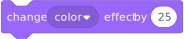</td>
<td>В разработке</td>
</tr>
<tr>
<td>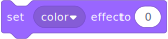</td>
<td>В разработке</td>
</tr>
<tr>
<td>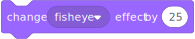</td>
<td>В разработке</td>
</tr>
<tr>
<td>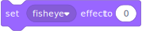</td>
<td>В разработке</td>
</tr>
<tr>
<td></td>
<td>В разработке</td>
</tr>
<tr>
<td>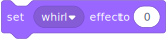</td>
<td>В разработке</td>
</tr>
<tr>
<td>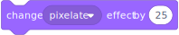</td>
<td>В разработке</td>
</tr>
<tr>
<td></td>
<td>В разработке</td>
</tr>
<tr>
<td>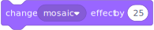</td>
<td>В разработке</td>
</tr>
<tr>
<td>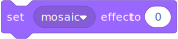</td>
<td>В разработке</td>
</tr>
<tr>
<td>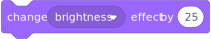</td>
<td>В разработке</td>
</tr>
<tr>
<td>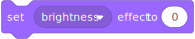</td>
<td>В разработке</td>
</tr>
<tr>
<td>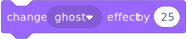</td>
<td>В разработке</td>
</tr>
<tr>
<td></td>
<td>В разработке</td>
</tr>
<tr>
<td>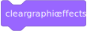</td>
<td>В разработке</td>
</tr>
<tr>
<td>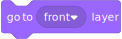</td>
<td>В разработке</td>
</tr>
<tr>
<td>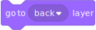</td>
<td>В разработке</td>
</tr>
<tr>
<td>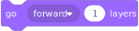</td>
<td>В разработке</td>
</tr>
<tr>
<td>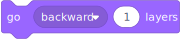</td>
<td>В разработке</td>
</tr>
<tr>
<td><a href="#spritecostume_number">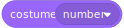</a></td>
<td><a href="#spritecostume_number"><code>sprite.costume_number</code></a></td>
</tr>
<tr>
<td><a href="#spritecostume_name">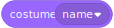</a></td>
<td><a href="#spritecostume_name"><code>sprite.costume_name</code></a></td>
</tr>
<tr>
<td>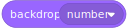</td>
<td>В разработке</td>
</tr>
<tr>
<td>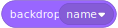</td>
<td>В разработке</td>
</tr>
<tr>
<td><a href="#spriteset_size_tovalue">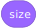</a></td>
<td><a href="#spriteset_size_tovalue"><code>sprite.size</code></a></td>
</tr>
</tbody>
</table>

## Самый маленький пример

```python
from pyscratch import Sprite, Stage, forever, wait

stage = Stage()
cat = stage.add(Sprite("Cat"))


@cat.when_green_flag_clicked
def walk():
    return forever(
        cat.move_steps(10),
        cat.if_on_edge_bounce(),
        wait(0.1),
    )


stage.play()
```

Что делает программа:

- создает сцену;
- создает спрайт `Cat`;
- когда нажимается зеленый флаг, кот все время идет вперед;
- если кот дошел до края, он отскакивает.

## Сцена

Сцена - это место, где живут спрайты.

### `Stage()`

Создать сцену.

```python
stage = Stage()
```

Можно указать размер и цвет фона:

```python
stage = Stage(width=480, height=360, background_color=(230, 245, 255))
```

Цвет записывается как три числа: красный, зеленый, синий.

### `stage.add(sprite)`

Добавить спрайт на сцену.

```python
cat = stage.add(Sprite("Cat"))
```

### `stage.play()`

Запустить окно с программой.

```python
stage.play()
```

Можно написать название окна:

```python
stage.play("Моя игра")
```

### `stage.run_for(seconds)`

Запустить программу на несколько секунд без окна. Это удобно для проверки.

```python
stage.run_for(2)
```

## Спрайт

Спрайт - это герой на сцене.

### `Sprite(name)`

Создать спрайт.

```python
cat = Sprite("Cat")
```

Можно сразу указать место, направление, размер и цвет:

```python
cat = Sprite("Cat", x=0, y=0, direction=90, size=100, color=(255, 170, 40))
```

В `pyscratch` координаты похожи на Scratch:

- `x = 0`, `y = 0` - центр сцены;
- `x` больше - правее;
- `x` меньше - левее;
- `y` больше - выше;
- `y` меньше - ниже.

## События

### `@sprite.when_green_flag_clicked`

Команды внутри этой функции начнут работать, когда программа запустится.

```python
@cat.when_green_flag_clicked
def start():
    return forever(
        cat.move_steps(10),
        wait(0.2),
    )
```

## Клавиатура

Для клавиатуры можно напрямую использовать библиотеку `keyboard`.

```python
import keyboard

from pyscratch import Sprite, Stage

stage = Stage()
cat = stage.add(Sprite("Cat"))


@cat.when_green_flag_clicked
def control():
    while True:
        if keyboard.is_pressed("right"):
            cat.change_x_by(5)
        if keyboard.is_pressed("left"):
            cat.change_x_by(-5)


stage.play()
```

Это обычная Python-библиотека, поэтому можно использовать и другие ее возможности:
`keyboard.is_pressed(...)`, `keyboard.write(...)`, `keyboard.add_hotkey(...)`.

## Движение

### `sprite.move_steps(steps)`

Идти вперед на несколько шагов.

```python
cat.move_steps(10)
```

### `sprite.turn_right(degrees)`

Повернуться направо.

```python
cat.turn_right(15)
```

### `sprite.turn_left(degrees)`

Повернуться налево.

```python
cat.turn_left(15)
```

### `sprite.go_to(x, y)`

Перейти в точку `x`, `y`.

```python
cat.go_to(100, 50)
```

### `sprite.change_x_by(value)`

Изменить `x`.

```python
cat.change_x_by(10)
```

### `sprite.change_y_by(value)`

Изменить `y`.

```python
cat.change_y_by(10)
```

### `sprite.set_x(value)`

Установить `x`.

```python
cat.set_x(0)
```

### `sprite.set_y(value)`

Установить `y`.

```python
cat.set_y(0)
```

### `sprite.point_in_direction(degrees)`

Повернуться в нужное направление.

```python
cat.point_in_direction(90)
```

Направления:

- `90` - вправо;
- `-90` или `270` - влево;
- `0` - вверх;
- `180` - вниз.

### `sprite.if_on_edge_bounce()`

Если спрайт коснулся края сцены, он отскакивает.

```python
cat.if_on_edge_bounce()
```

Край считается не по центру спрайта, а по его форме для столкновений.

## Касания

### `sprite.touching_sprite(other)`

Проверить, касается ли один спрайт другого.

```python
if cat.touching_sprite(ball):
    cat.hide()
```

Сейчас касание считается по простому кругу вокруг спрайта. Это быстро и подходит для первых игр.

### `sprite.touching_any_sprite()`

Проверить, касается ли спрайт любого другого спрайта на сцене.

```python
if cat.touching_any_sprite():
    cat.turn_right(180)
```

### `sprite.touching_edge()`

Проверить, касается ли спрайт края сцены.

```python
if cat.touching_edge():
    cat.turn_right(180)
```

## Внешний вид

### `sprite.show()`

Показать спрайт.

```python
cat.show()
```

### `sprite.hide()`

Спрятать спрайт.

```python
cat.hide()
```

### `sprite.change_size_by(value)`

Изменить размер.

```python
cat.change_size_by(10)
```

### `sprite.set_size_to(value)`

Установить размер.

```python
cat.set_size_to(100)
```

`100` - обычный размер.

### `Sprite(name, costumes={...})`

Создать спрайт с несколькими костюмами.

```python
cat = Sprite(
    "Cat",
    costumes={
        1: "cat/costume1.svg",
        2: "cat/costume2.svg",
    },
)
```

Относительные пути считаются от файла, где создан спрайт.

### `sprite.switch_costume_to(costume)`

Выбрать картинку для спрайта.

```python
cat.switch_costume_to(2)
cat.switch_costume_to("costume1")
cat.switch_costume_to("cat/costume2.svg")
```

Можно по-прежнему использовать один путь без словаря:

```python
cat = Sprite("Cat", costume="assets/cat.png")
cat.switch_costume_to("assets/cat2.png")
```

### `sprite.next_costume()`

Перейти к следующему костюму.

```python
cat.next_costume()
```

### `sprite.costume_number`

Номер текущего костюма.

```python
if cat.costume_number == 2:
    cat.turn_right(15)
```

### `sprite.costume_name`

Имя текущего костюма без расширения файла.

```python
if cat.costume_name == "costume2":
    cat.hide()
```

## Управление

Эти команды похожи на оранжевые блоки Scratch.

### `wait(seconds)`

Подождать несколько секунд.

```python
wait(1)
```

### `repeat(times, commands...)`

Повторить команды несколько раз.

```python
return repeat(
    10,
    cat.move_steps(10),
    wait(0.1),
)
```

### `forever(commands...)`

Повторять команды всегда.

```python
return forever(
    cat.move_steps(10),
    cat.if_on_edge_bounce(),
    wait(0.1),
)
```

### `sequence(commands...)`

Выполнить команды по порядку.

```python
return sequence(
    cat.go_to(0, 0),
    cat.move_steps(50),
    wait(1),
    cat.hide(),
)
```

## Важное правило

Команды движения и внешнего вида обычно пишутся внутри `return forever(...)`, `return repeat(...)` или `return sequence(...)`.

```python
return forever(
    cat.move_steps(10),
    cat.if_on_edge_bounce(),
    wait(0.1),
)
```

Так движок понимает, какие команды нужно выполнять во время работы программы.

## Что уже есть

Сейчас доступны:

- сцена;
- спрайты;
- запуск по зеленому флагу;
- движение;
- повороты;
- переход в точку;
- отскок от края;
- касание других спрайтов;
- показать и спрятать спрайт;
- размер спрайта;
- картинка-костюм;
- клавиатура через библиотеку `keyboard`;
- ожидание;
- повторение команд;
- бесконечный цикл;
- запуск окна через pygame.

## Чего пока нет

Пока еще не добавлены:

- мышь;
- сообщения `broadcast`;
- звуки;
- переменные в стиле Scratch;
- списки;
- клоны.
